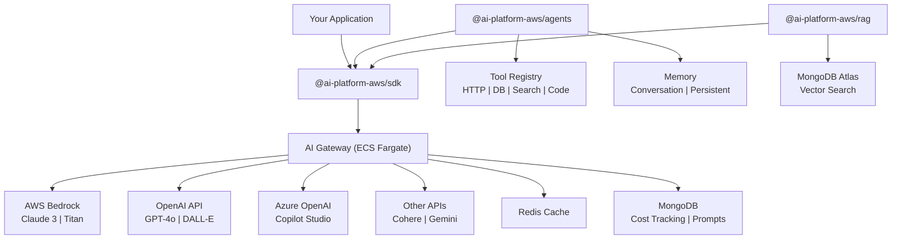
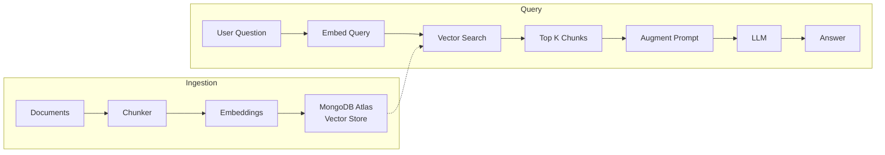
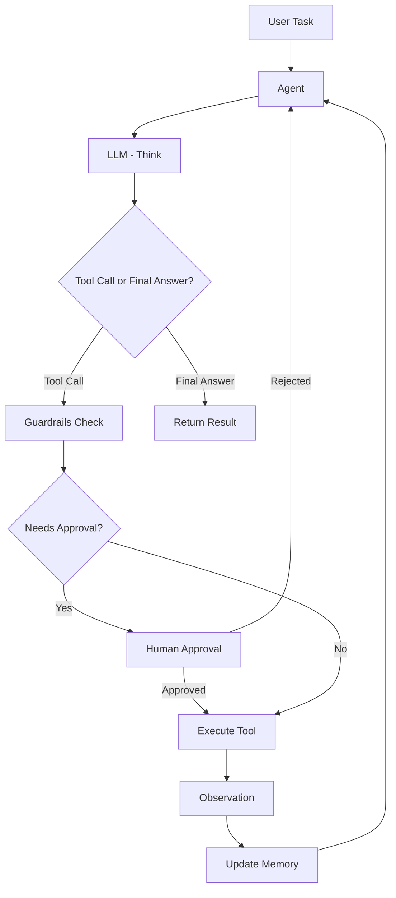
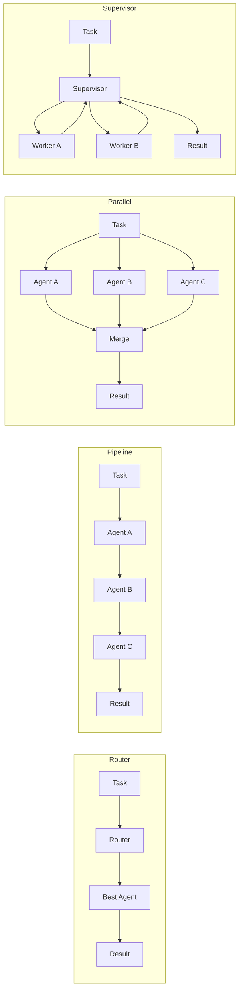

# AI Platform AWS

> Production-ready AI platform for AWS. Gateway, SDK, RAG, Agents, and more.

[](https://github.com/tysoncung/ai-platform-aws/actions/workflows/ci.yml)
[](https://opensource.org/licenses/MIT)

## Overview

AI Platform AWS is a unified API platform that routes AI/ML requests across multiple providers. It provides a single interface to interact with AWS Bedrock, OpenAI, and other AI providers with built-in caching, rate limiting, cost tracking, and streaming support.

### Architecture




> *Editable source: [architecture-overview.drawio](docs/diagrams/architecture-overview.drawio) -- open in [draw.io](https://app.diagrams.net/)*

## Quick Start

### Using Docker Compose

```bash
# Clone the repository
git clone https://github.com/tysoncung/ai-platform-aws.git
cd ai-platform-aws

# Configure environment
cp .env.example .env
# Edit .env with your API keys

# Start all services
docker-compose up -d

# Test health endpoint
curl http://localhost:3100/health
```

### Local Development

```bash
# Prerequisites: Node.js 22+, pnpm 9+
pnpm install

# Generate OpenAPI types
pnpm nx run openapi:generate

pnpm build

# Start Redis and MongoDB
docker-compose up -d redis mongodb

# Start the gateway in dev mode
pnpm dev
```

## SDK Usage

```typescript
import { AIGateway } from '@ai-platform-aws/sdk';

const gateway = new AIGateway({
  baseUrl: 'http://localhost:3100',
  apiKey: 'your-api-key', // optional
});

// Simple completion
const response = await gateway.complete({
  messages: [{ role: 'user', content: 'Explain quantum computing' }],
  model: 'claude-3-haiku',
});

console.log(response.content);
console.log(`Cost: $${response.usage.estimatedCost}`);

// Streaming
for await (const chunk of gateway.stream({
  messages: [{ role: 'user', content: 'Write a story' }],
  model: 'gpt-4o',
})) {
  process.stdout.write(chunk);
}

// Embeddings
const { embeddings } = await gateway.embed({
  input: ['hello world', 'goodbye world'],
  model: 'text-embedding-3-small',
});

// Classification
const result = await gateway.classify({
  input: 'I love this product!',
  labels: ['positive', 'negative', 'neutral'],
});
```

## API Reference

### `POST /v1/complete`

Generate a text completion.

```json
{
  "model": "claude-3-haiku",
  "messages": [{ "role": "user", "content": "Hello" }],
  "maxTokens": 1024,
  "temperature": 0.7,
  "stream": false,
  "systemPrompt": "You are a helpful assistant"
}
```

### `POST /v1/embed`

Generate embeddings.

```json
{
  "model": "titan-embed",
  "input": ["text to embed"]
}
```

### `POST /v1/classify`

Classify text into categories.

```json
{
  "model": "claude-3-haiku",
  "input": "Text to classify",
  "labels": ["positive", "negative", "neutral"]
}
```

### `GET /health`

Health check endpoint.

## Provider Configuration

### AWS Bedrock

Supported models:
- `claude-3-sonnet` - High capability
- `claude-3-haiku` - Fast and cost-effective
- `titan-embed` - Text embeddings

Configure via environment variables:
```bash
AWS_REGION=ap-southeast-2
AWS_ACCESS_KEY_ID=your-key
AWS_SECRET_ACCESS_KEY=your-secret
```

### OpenAI

Supported models:
- `gpt-4o` - Latest GPT-4
- `gpt-4o-mini` - Cost-effective
- `text-embedding-3-small` - Compact embeddings
- `text-embedding-3-large` - High-dimension embeddings

```bash
OPENAI_API_KEY=your-key
```

## RAG Pipeline




The `@ai-platform-aws/rag` package provides a ready-to-use RAG pipeline:

```typescript
import { RAGPipeline } from '@ai-platform-aws/rag';

const rag = new RAGPipeline({
  gatewayUrl: 'http://localhost:3100',
  mongoUrl: 'mongodb://localhost:27017',
  database: 'my_app',
  collection: 'documents',
});

await rag.connect();

// Ingest documents
await rag.ingest('Your document text here...', { source: 'doc.pdf' });

// Query
const result = await rag.query('What is the main topic?');
console.log(result.answer);
console.log(`Sources: ${result.sources.length}`);
```

## Deployment (AWS CDK)


```bash
cd infra
pnpm install

# Bootstrap CDK (first time)
pnpm cdk bootstrap

# Deploy
pnpm deploy

# Deploy with alarm email
pnpm cdk deploy --all --context alarmEmail=you@example.com
```

This deploys:
- **ECS Fargate** - Auto-scaling container service (2-10 tasks)
- **Application Load Balancer** - Public-facing HTTPS endpoint
- **ElastiCache Redis** - Response caching
- **CloudWatch** - Dashboards and alarms

## Monorepo Management

This project uses **Nx** for monorepo management on top of pnpm workspaces, and **OpenAPI** for contract-first API design.

### Nx

Nx provides build caching, task orchestration, and affected-based CI:

```bash
# Build all packages
pnpm build

# Only build/test affected packages (CI)
pnpm build:affected
pnpm test:affected

# Run a specific target
pnpm nx run gateway:typecheck
```

### OpenAPI Contract-First

The API contract is defined in `packages/openapi/openapi.yaml`. TypeScript types are auto-generated from this spec and shared across the gateway and SDK - a single source of truth.

```bash
# Generate types from the OpenAPI spec
pnpm nx run openapi:generate

# Types are output to packages/openapi/generated/types.ts
```

The SDK uses `openapi-fetch` for fully typed API calls that match the spec exactly.

## Agents Framework

The `@ai-platform-aws/agents` package provides a full agentic AI framework built on top of the gateway.

### Architecture

The Gateway handles LLM calls; Agents handle orchestration, tool use, memory, and multi-step reasoning.




> *Editable source: [agent-react-loop.drawio](docs/diagrams/agent-react-loop.drawio) -- open in [draw.io](https://app.diagrams.net/)*

### Multi-Agent Orchestration Patterns




### Quick Start

```typescript
import { AIGateway } from '@ai-platform-aws/sdk';
import { Agent, calculatorTool, httpTool } from '@ai-platform-aws/agents';

const gateway = new AIGateway({ baseUrl: 'http://localhost:3100' });

const agent = new Agent(
  {
    name: 'assistant',
    description: 'A helpful research assistant',
    model: 'claude-3-haiku',
    tools: [calculatorTool, httpTool],
    maxIterations: 10,
  },
  gateway,
);

const result = await agent.run('What is 42 * 17 plus the square root of 256?');
console.log(result.output);
```

### Features

- **ReAct Loop** - Think -> Act -> Observe -> Repeat until done
- **Built-in Tools** - HTTP, MongoDB, vector search, calculator, file system, sandboxed code execution
- **Memory** - In-memory conversation history + MongoDB-backed long-term memory with vector search
- **Planner** - LLM-powered task decomposition and re-planning on failure
- **Multi-Agent Orchestration** - Route, pipeline, parallel, and supervisor patterns
- **Guardrails** - Block destructive ops, PII detection, cost limits, domain allowlists
- **Human-in-the-Loop** - Configurable approval for sensitive tool calls

See [`packages/agents/`](packages/agents/) for full documentation.

## Examples

Ready-to-run examples demonstrating real-world usage patterns:

| Example | Description |
|---------|-------------|
| [Bedrock Basic](examples/bedrock-basic/) | Get started with AWS Bedrock - completions, streaming, embeddings, and vision |
| [OpenAI External](examples/openai-external/) | Use OpenAI models with automatic fallback to Bedrock |
| [BYOK Multi-Tenant](examples/byok-multi-tenant/) | Let users bring their own API keys with per-tenant billing and rate limiting |
| [RAG Pipeline](examples/rag-pipeline/) | Full retrieval-augmented generation with MongoDB Atlas Vector Search |
| [Agent Basic](examples/agent-basic/) | Simple agent with calculator + HTTP tools using the ReAct pattern |
| [Agent Multi](examples/agent-multi/) | Multi-agent pipeline: researcher -> writer -> reviewer |
| [Agent Auto-Tagger](examples/agent-auto-tagger/) | Agent that auto-tags a product catalog using DB queries + LLM analysis |

Each example is self-contained with its own README, dependencies, and `.env.example`.

## Project Structure

```
ai-platform-aws/
 packages/
    openapi/          # OpenAPI spec & generated types
    gateway/          # Fastify AI Gateway service
    sdk/              # TypeScript client SDK (openapi-fetch)
    rag/              # RAG pipeline utilities
    agents/           # Agentic AI framework (ReAct, tools, memory, orchestration)
 examples/
    bedrock-basic/    # AWS Bedrock usage examples
    openai-external/  # OpenAI with fallback
    byok-multi-tenant/# Bring Your Own Key multi-tenant
    rag-pipeline/     # Full RAG with MongoDB Atlas
    agent-basic/      # Simple agent example
    agent-multi/      # Multi-agent pipeline
    agent-auto-tagger/# Auto-tagging with DB + LLM
 infra/                # AWS CDK infrastructure
 nx.json               # Nx configuration
 docker-compose.yml    # Local development
 .github/workflows/    # CI/CD (nx affected)
```

## Contributing

See [CONTRIBUTING.md](CONTRIBUTING.md) for guidelines.

## License

[MIT](LICENSE)
